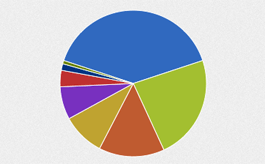
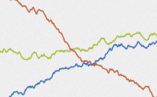
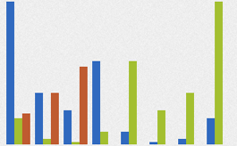
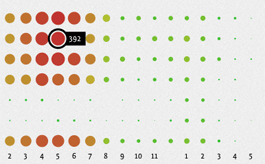

# gRaphaël

gRaphaël's goal is to help you create stunning charts on your website. It is based on [Raphaël](http://raphaeljs.com) graphics library. Check out the [demos](http://g.raphaeljs.com) to see static and interactive charts in action.

gRaphaël currently supports Firefox 3.0+, Safari 3.0+, Opera 9.5+ and Internet Explorer 6.0+

## Types of charts available

* Pie Charts
* Bar Charts
* Line Charts
* Dot Charts

## Example Usage

Include `raphael.js`, `g.raphael.js` and any (or all) of `g.line.js`, `g.bar.js`, `g.dot.js` and `g.pie.js` into your HTML page and then use it:

    // Creates canvas 640 × 480 at 10, 50
    var paper = Raphael(10, 50, 640, 480);
    // Creates pie chart at with center at 320, 200, radius 100
    // and data: [55, 20, 13, 32, 5, 1, 2, 10]
    r.g.piechart(320, 240, 100, [55, 20, 13, 32, 5, 1, 2, 10]);

## Sample Chart Images

## More information

For more information, visit <http://g.raphaeljs.com>